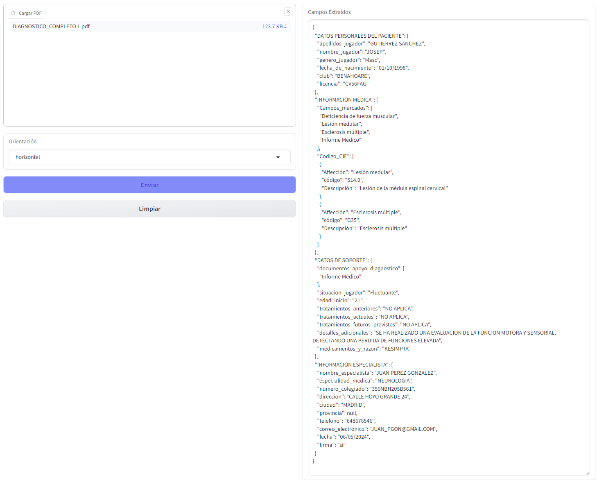
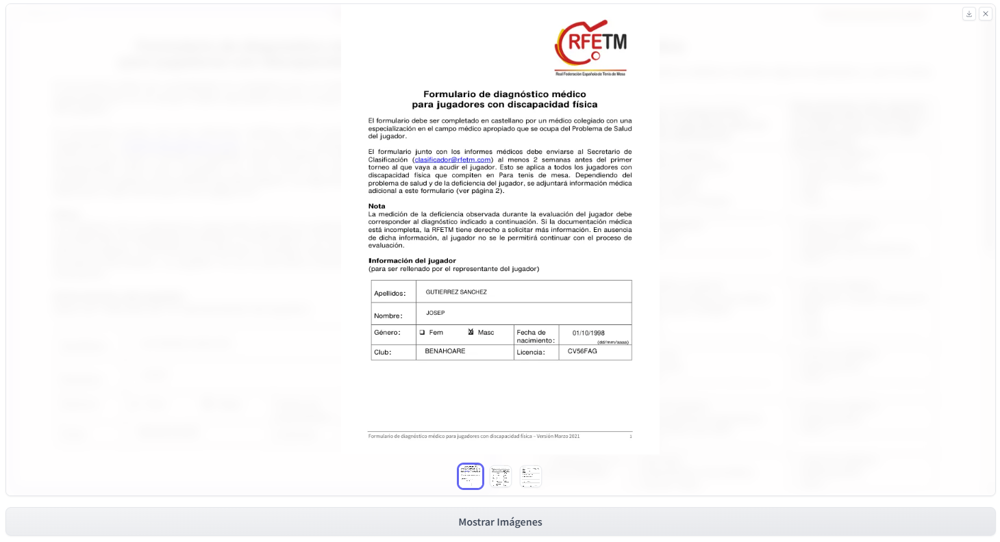
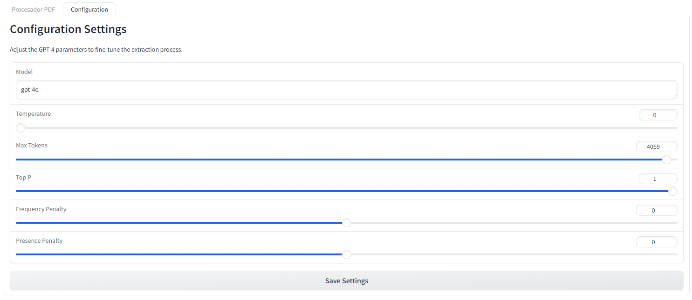

# ICD-10 Code Extraction from Medical Diagnosis PDF documents


Welcome to our **ICD-10 Code Extraction Tool**! 

This application helps you extract data from PDF documents using a Vision model and GPT-4 Omnium. 
Additionally, it offers a virtual assistant to answer your questions about ICD-10 codes powered by RAG system with FAISS and Longchain. 

*Please note that the assistant is in beta, so the database indexed just contain a short list of conditions. Too check the list find it in the bottom of this README file*


## Features

- **PDF Data Extraction**: Upload a PDF to extract and identify conditions in marked fields and provide the most rellevant ICD-10 code (CIE-10 in spanish).
- **Image Display**: View the pages of your PDF as images.
- **CIE-10 Virtual Assistant**: Get detailed answers to your questions about CIE-10 codes, this si beta feature, so the db is sampled to a small list of conditions.
- **Configuration Settings**: Selection of OpenAI model and config of GPT-4 parameters for more accurate data extraction.

## Getting Started


## Running the Application

- Create a `.env` file and add your open api key.

 - To run the application, execute the following command in your terminal:

```sh python main.py```

After that you will see a ling to the Interface, the link is composed by a code ended with .gradio.live. 
    example: [https://cb450902f541408b0a.gradio.live/]

Click the link to access to the User Interface.

### 1. Upload a PDF

To begin, upload a PDF document that you want to extract data from.


1. Click on **"Cargar PDF"**.
2. Choose your PDF file.
3. Select the orientation for image joining of the pdf, by default is set to horizontal.

### 2. Extract Data

After uploading your PDF:



1. Click on **"Enviar"** to process the PDF.
2. The extracted fields will appear in the **"Campos Extraídos"** box. 
    *Note: The information showed above is a mockup, no real data has been used*.


### 3. Display Images

To view the pages of your uploaded PDF as images:



1. Click on **"Mostrar Imágenes"**.
2. The images will appear in the **"Páginas PDF"** gallery.


### 4. Virtual Assistant

Ask the virtual assistant about ICD-10 codes:


1. Enter your question in the **"Pregunta"** box.
2. Click on **"Enviar"**.
3. The answer will appear in the **"Respuesta"** box.


### 5. Download Extracted Data

You can download the extracted data in JSON or Excel format:


- Click on **"Descargar en JSON"** to download a JSON file.
- Click on **"Descargar en Excel"** to download an Excel file.


### 6. Configuration Settings

Adjust the GPT-4 parameters to improve data extraction accuracy:



1. Go to the **"Configuration"** tab.
.
2. Adjust the settings for: 
   - __Model__: *The specific OpenAI model to use for data extraction.*
    - __Temperature__: *Controls the creativity of the responses.*
    - __Max Tokens__: *The maximum number of tokens for the response.*
    - __Top P__: *Controls diversity via nucleus sampling*
    - __Frequency Penalty__: *Reduces the likelihood of repeated phrases by penalizing frequent tokens.*
    - __Presence Penalty__: *Forces the model to talk about new topics by penalizing tokens that have already appeared.*
.
3. Click on **"Save Settings"** to apply your changes.


### List of conditions for the Assistant
- Adamantinoblastoma
- Adamantinoma
- Quiste, calcificación odontogénica - huesos largos 
    - miembro inferior 
    - miembro superior 
    - maligno 
    - mandíbula (hueso) 
    - (parte inferior) 
    - superior 
    - tibial 
- Adamantoblastoma
- Adams-Stokes (-Morgagni), enfermedad o síndrome de 
- Adaptación, reacción de
- Trastorno, adaptación
- Addison, de
- Anemia (perniciosa) 
    - enfermedad (bronceada) o síndrome
    - tuberculoso 
    - queloide 
- Addison-Biermer, anemia (perniciosa) de 
- Addisoniana, crisis 
- Addison-Schilder, complejo de 
- Adelgazamiento vertebral
- Espondilopatía, especificada NCOC
- Adenitis
- Linfadenitis
 - aguda, localización no especificada 
 - axilar 
 - aguda 
 - crónica o subaguda 
 - Bartolino, glándula de 
 - cervical 
 - aguda 
 - crónica o subaguda 
 - chancroide (Haemophilus ducreyi) 
 - conducto de Wharton (supurativa)
    - véase Sialoadenitis
 - conducto o glándula de Skene
    - véase Uretritis
 - Cowper, glándula de
    - véase Uretritis
    - crónica, localización no especificada 
    - debida a Pasteurella multocida (P. septica) 
    - epidémica, aguda 
 - escrófula (tuberculosa) 
 - estruma, tuberculosa 
 - ganglio o nódulo linfático, excepto mesentérico 
    - aguda
        - véase Linfadenitis, aguda
    - crónica o subaguda 
 - gangrenosa 
 - glándula
     - bulbouretral
     - véase Uretritis
     - parótida (supurativa)
     - véase Sialoadenitis
     - salival (cualquiera) (supurativa)
     - véase Sialoadenitis
     - sublingual (supurativa)
     - véase Sialoadenitis
     - submandibular (supurativa)
     - véase Sialoadenitis
     - submaxilar (supurativa)
     - véase Sialoadenitis
     - uretral
     - véase Uretritis
 - gonorrea NCOC 
 - infecciosa (aguda) (epidémica) 
 - inguinal 
    - aguda 
    - crónica o subaguda 
 - mesentérica (aguda) (crónica) (no especificada) (subaguda) 
 - subaguda, localización no especificada 
 - tuberculosa
     - véase Tuberculosis, ganglio linfático
 - Adenoacantoma
 - Neoplasia, maligna, por localización
 - Adenoamel

